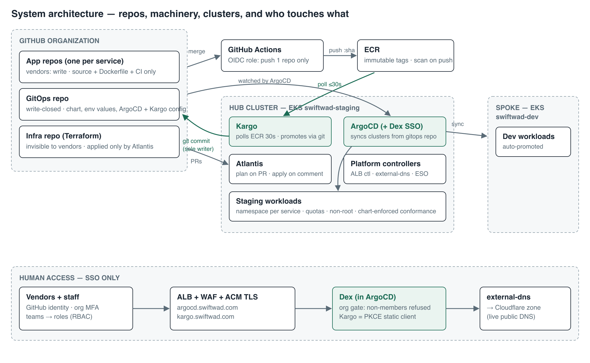
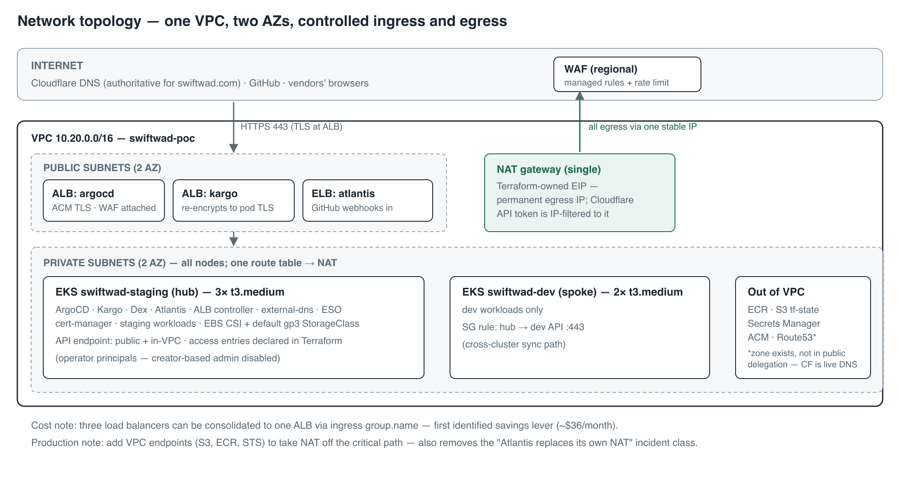
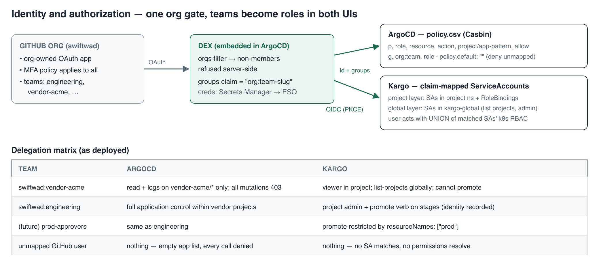
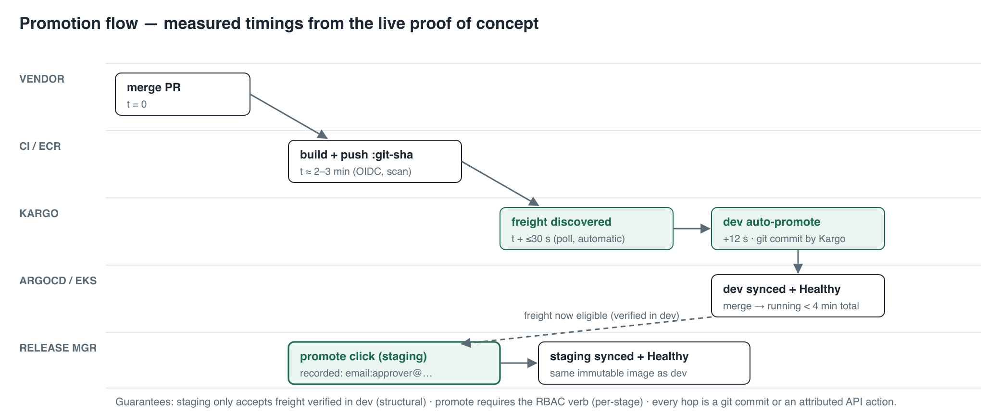

# Vendor Delivery Platform — Technical Architecture

| | |
|---|---|
| **Status** | Proof of concept complete; destroy-and-rebuild validated from automation |
| **Audience** | Engineers, architects, security reviewers |
| **Companions** | Business brief (leadership); SETUP-GUIDE.md (build walkthrough); RBAC-DELEGATION.md (access model) — platform-infra repository |
| **Last updated** | August 2026 |

## 1. Purpose and design principle

Vendor teams write and ship applications on our AWS estate without holding any infrastructure access. The platform's single design principle: **every boundary is structural, not procedural** — enforced by credentials that don't exist, trust policies that don't match, and promotion paths that don't connect, rather than by policy documents.

## 2. System architecture

Three repositories partition all write access; the partition *is* the security model:

| Repository | Contents | Vendor access | Writers |
|---|---|---|---|
| App repos (one per service) | Source, Dockerfile, one CI workflow | Write | Vendor |
| GitOps repo | Helm chart template, `envs/<env>/*.yaml`, ArgoCD + Kargo config | None (read at most) | Humans by PR; **Kargo is the only writer of `image.tag`** (own deploy key) |
| Infra repo | Terraform, Atlantis config, docs, bootstrap script | None — not even read | Humans by PR; **applied only by Atlantis** |

Component inventory (as deployed):

| Component | Runs on | Version/pin | Identity |
|---|---|---|---|
| EKS clusters `swiftwad-dev`, `swiftwad-staging` | — | Kubernetes 1.34, AL2023 nodes | Operator access entries declared in Terraform (`operator_principal_arns`); creator-based admin **disabled** |
| ArgoCD (+ embedded Dex) | staging (hub) | argo-cd helm chart (v3.x app) | — |
| Kargo | staging | kargo helm chart 1.x | Controller: IRSA `kargo-controller-swiftwad-staging` (ECR read) |
| Atlantis | staging | runatlantis chart | IRSA `atlantis-swiftwad-staging` (admin, boundary-scoped in prod) |
| aws-load-balancer-controller | staging, kube-system | chart 1.13.0 (ArgoCD app) | IRSA (vendored official policy) |
| external-dns | staging | chart 1.15.2 (ArgoCD app) | **Cloudflare provider** — API token via ESO |
| external-secrets | staging | chart 0.14.4 (ArgoCD app) | IRSA scoped to `argocd/*`, `platform/*` secrets |
| cert-manager | staging | jetstack chart | — (Kargo webhook certs) |

## 3. Network and infrastructure

Key decisions and their reasons:

- **Single VPC, single NAT, terraform-owned EIP.** The Cloudflare DNS token is IP-filtered to the egress address, so the address must survive rebuilds — an `aws_eip` passed via `external_nat_ip_ids`, not the module's auto-allocated one.
- **DNS reality check**: the account's Route53 zone for the domain is *not* in the public delegation path — the registrar delegates to Cloudflare. external-dns therefore runs the Cloudflare provider; records written to Route53 would never resolve. Verify with `dig +short NS <domain>` before assuming.
- **Storage**: EKS ships no CSI driver *and* current EKS marks no StorageClass default. Terraform installs the EBS CSI addon; bootstrap creates a default encrypted `gp3` class. Without both, any PVC waits forever.
- **Cross-cluster path**: hub → spoke API on :443 requires an explicit SG rule (`hub_to_dev_api`) even inside one VPC.

IAM role inventory (all created by Terraform):

| Role | Assumed by | Permissions | Trust condition |
|---|---|---|---|
| `gh-actions-<service>` | Vendor CI via GitHub OIDC | Push/pull **one** ECR repo + `GetAuthorizationToken` | `sub` matches the repo — **both plain and ID-pinned forms** (`repo:org@id/repo@id:*`) |
| `kargo-controller-…` | Kargo controller (IRSA) | `DescribeImages`, `BatchGetImage`, `GetDownloadUrlForLayer`, `ListImages` on service repos | SA `kargo:kargo-controller` |
| `atlantis-…` | Atlantis pod (IRSA) | Admin (POC); permissions boundary in production | SA `atlantis:atlantis` |
| `alb-controller-…` | ALB controller (IRSA) | Vendored official policy | SA `kube-system:aws-load-balancer-controller` |
| `external-dns-…` | external-dns (IRSA) | Route53 on one zone (legacy; CF token is the live path) | SA `external-dns:external-dns` |
| `external-secrets-…` | ESO (IRSA) | `GetSecretValue`/`DescribeSecret` on `argocd/*`, `platform/*` | SA `external-secrets:external-secrets` |
| `ebs-csi-<cluster>` | EBS CSI controller (IRSA) | `AmazonEBSCSIDriverPolicy` | SA `kube-system:ebs-csi-controller-sa` |

## 4. Identity and authorization

**Authentication chain**: GitHub org OAuth app → Dex (embedded in ArgoCD) with `orgs: [swiftwad]` — login *fails at Dex, server-side*, for any non-member, regardless of what the user authorizes. Dex issues identity + `groups` claims (`org:team-slug`). Kargo authenticates against the **same Dex** as an OIDC PKCE public static client (`id: kargo`) — one OAuth app, one gate, both UIs. Dex credentials live in Secrets Manager, delivered by ExternalSecret (`part-of: argocd` label required for `$secret:key` references in `dex.config`).

**ArgoCD authorization**: AppProjects bound what applications may do (source repos, destinations, resource kinds); `policy.csv` bounds users, scoped `project/app-pattern`, with `policy.default: ""` denying anything unmapped. Environment granularity via app-name patterns (`vendor-acme/*-dev`).

**Kargo authorization** is Kubernetes RBAC resolved through claim-annotated ServiceAccounts (`rbac.kargo.akuity.io/claim.groups: org:team`), in **two mandatory layers**: project-namespace SAs (RoleBindings to `kargo-admin`/`kargo-user`/`kargo-viewer`) and global SAs in `kargo-global` (registered via `api.oidc.globalServiceAccounts.namespaces`) for cluster-scoped verbs — without the global layer, every login fails at "list projects." The custom **`promote` verb on Stages** (supports `resourceNames` per stage) is the release-manager grant; EKS access policies do not satisfy custom verbs, so it is always an explicit binding. Every Promotion records `create-actor` (e.g. `email:approver@company.com`).

**Two integration gotchas** (both solved in config): Kargo's UI fetches Dex discovery cross-origin from the browser, and ArgoCD's embedded Dex discards `web.allowedOrigins` — the CORS header is injected by the ArgoCD ALB via `listener-attributes` annotation, scoped to the Kargo origin. And GitHub org prerequisites (MFA required, base repo permission `none`, no member public repos) are part of the auth boundary, not optional hygiene.

## 5. CI/CD and promotion

**Build**: vendor merge → GitHub Actions assumes the per-repo OIDC role → builds → pushes `:$GITHUB_SHA` to ECR (immutable tags, scan-on-push). CI holds no other credential and writes to no other system. At >3 services, the workflow body moves to an org-level reusable workflow so vendors can edit their pipelines without touching credentialed steps.

**Promotion (Kargo)**: the Warehouse polls ECR every 30 s (`imageSelectionStrategy: NewestBuild` — tags are SHAs, SemVer matches nothing). New images become Freight; the dev Stage has `autoPromotionEnabled: true`; staging's `requestedFreight.sources.stages: [dev]` makes untested builds structurally ineligible. Promotion steps: `git-clone → yaml-update → git-commit → git-push → argocd-update`, using Kargo's own write deploy key (secret labeled `kargo.akuity.io/cred-type: git`); target ArgoCD Applications carry `kargo.akuity.io/authorized-stage: <project>:<stage>`. The Kargo project is named `<service>-delivery` because a Project owns a namespace of its own name on the hub, where `<service>` may already exist.

**Conformance is chart-enforced**: one Helm chart template for all services; `values.schema.json` rejects non-ECR registries, `latest`, privileged ports, missing probes/resources; the securityContext (non-root, read-only rootfs, dropped capabilities) is hardcoded in templates, not exposed in values.

**Measured timings (live POC, not projected)**: build ≈ 2–3 min · freight ≤ 30 s after push · dev promotion +12 s · merge → running in dev < 4 min · staging = one attributed click.

## 6. Infrastructure change management (Atlantis)

Plan-on-PR, apply-on-comment (`atlantis apply`), state locking, re-plan on every push. `apply_requirements: [approved, mergeable]` once more than one operator exists. Production upgrades: GitHub App auth, ingress + TLS, webhook restricted to GitHub IP ranges, permissions boundary on the role.

Operational rules paid for in incident time:

1. **Atlantis cannot replace the NAT it egresses through** — destroy-then-create severs its own AWS/S3/GitHub path mid-apply. Run VPC-egress surgery from break-glass credentials outside the cluster, or add VPC endpoints (S3/STS/ECR) which removes the failure class entirely.
2. **Never force-unlock a possibly-live lock** — a stalled apply resumed after egress recovery and overwrote interim state; repair required `terraform state rm` + `import`. Kill the pod first or wait out the lock.
3. The EKS module **ignores `desired_size` after creation** — scale desired via `aws eks update-nodegroup-config` before raising `min_size` in Terraform.

## 7. Secrets management

All platform secrets follow one path: **AWS Secrets Manager → External Secrets Operator → Kubernetes Secret**, so nothing sensitive enters git, Terraform state, or CI logs. Terraform creates the secret *containers*; values are set out-of-band (`aws secretsmanager put-secret-value`).

| Secret | Store key | Consumer | Notes |
|---|---|---|---|
| Dex GitHub OAuth | `argocd/dex-github` | argocd namespace (label `part-of: argocd`) | Referenced as `$argocd-dex-github:clientID/clientSecret` |
| Cloudflare DNS token | `platform/cloudflare-dns` | external-dns | Zone-scoped, DNS-edit only, **IP-filtered to the NAT EIP** |
| Kargo admin password | injected at helm install (bcrypt hash) | kargo-api | **Re-set on every rebuild** — the bootstrap re-applies its input; feed a fresh secret |
| Kargo gitops deploy key | k8s secret in project ns | Kargo promotion steps | `cred-type: git` label; repoURL must match clone URL exactly |
| ArgoCD admin (break-glass) | in-cluster initial secret | humans, emergencies only | Both UIs are SSO-only for daily use |

Sync-ordering note: ESO's own CRs (`ClusterSecretStore`, `ExternalSecret`) ship in the same root sync that installs ESO — they carry `SkipDryRunOnMissingResource=true`, and the platform AppProject syncs at the earliest wave, or the app-of-apps deadlocks (both observed).

## 8. Environments, scaling, disaster recovery

- **Environments**: dev (spoke) and staging (hub) today; production is one more cluster + one more Kargo stage gated on staging with its own `prod-approvers` team — mechanically identical. Production belongs in a **separate AWS account** (organization with per-env accounts + shared services); consolidate account sprawl, never environment boundaries.
- **Service scaling**: 1→10: ApplicationSets (directory generator over `envs/`), reusable CI workflow, `services` map in Terraform, Karpenter. 10→100: shard the ArgoCD application controller, raise repo-server replicas, mandatory ResourceQuotas + NetworkPolicies per vendor namespace.
- **DR**: everything rebuilds from three repos + `scripts/bootstrap.sh` (phased, idempotent, resumable). **Validated**: 112 resources destroyed, full rebuild ≈ 45 minutes, end-to-end vendor loop re-passed. Post-rebuild checks: re-set the Kargo admin password; ELB hostnames rotate (webhooks re-wired by the script); apps show Degraded until the first CI run repopulates a purged ECR — correct, not broken.
- **Cost (POC sizing)**: ≈ $395/month — control planes $146, 5× t3.medium ≈ $150, NAT ≈ $35, 3 ELBs ≈ $54, WAF ≈ $10. First levers: single shared ALB via `group.name` (−$36), spot for non-prod nodes, park idle environments (validated rebuild makes this cheap).

## 9. Gotcha index

Nineteen operational traps were hit and documented during the POC; the full list with fixes lives in `SETUP-GUIDE.md` §12. Highest-value five: ID-pinned GitHub OIDC `sub` claims; the cluster-creator access-entry flip-flop (fix: `enable_cluster_creator_admin_permissions = false` + operators in code, day one); no default StorageClass on current EKS; Kargo's two-layer RBAC; Atlantis vs. its own NAT.
